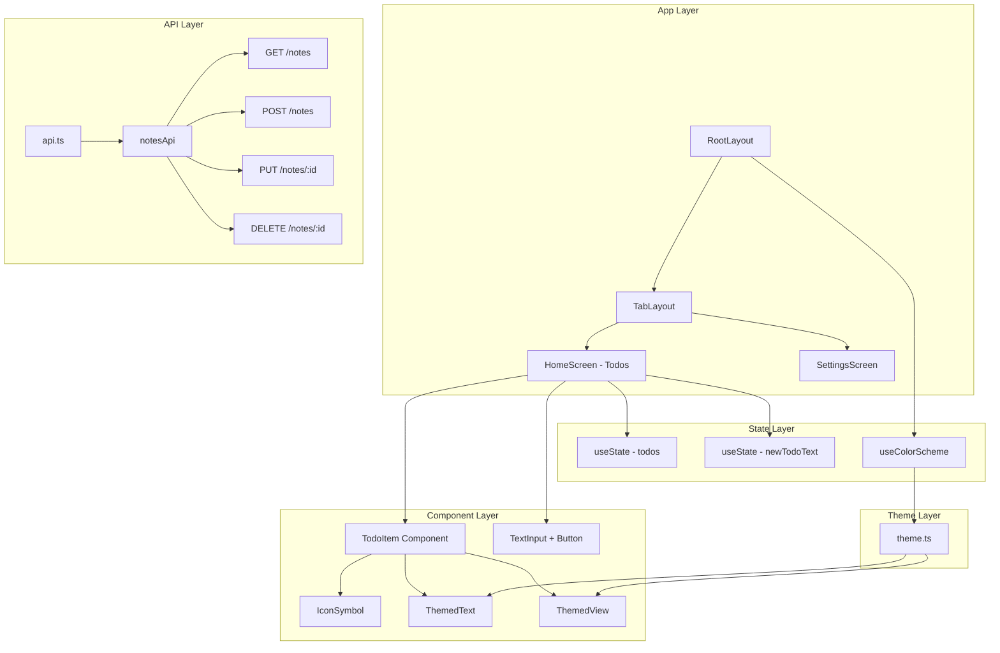

Rangkuman Materi Pembelajaran React Native Melalui Expo

## Table of Contents

1. [Pemahaman Dasar React Native & Expo](#1-pemahaman-dasar-react-native--expo)
2. [Setup & Environment](#2-setup--environment)
3. [Struktur & Arsitektur Project](#3-struktur--arsitektur-project)
4. [Manajemen Data & API](#4-manajemen-data--api)
5. [Build & Deployment](#5-build--deployment)

---

## 1. Pemahaman Dasar React Native & Expo

### Konsep Dasar React Native

#### **Komponen (Components)**
React Native menggunakan komponen sebagai building blocks utama:

```typescript
// Functional Component dengan TypeScript
interface TodoItemProps {
  id: string;
  text: string;
  completed: boolean;
  onToggle: (id: string) => Promise<boolean>;
}

export default function TodoItem({ id, text, completed, onToggle }: TodoItemProps) {
  return (
    <View style={styles.container}>
      <Text>{text}</Text>
    </View>
  );
}
```

#### **Props & State**
- **Props**: Data yang diteruskan dari parent ke child component
- **State**: Data internal component yang bisa berubah

```typescript
// State management dengan hooks
const [todos, setTodos] = useState<Todo[]>([]);
const [loading, setLoading] = useState(false);

// Props passing
<TodoItem 
  id={item.id}
  text={item.title}
  completed={item.completed}
  onToggle={handleToggle}
/>
```

#### **Hooks**
Custom hooks untuk logic yang reusable:

```typescript
// Custom hook untuk API management
export const useNotes = (): UseNotesReturn => {
  const [notes, setNotes] = useState<Note[]>([]);
  const [loading, setLoading] = useState(false);
  
  const addNote = useCallback(async (noteData: CreateNoteRequest) => {
    // API logic here
  }, []);
  
  return { notes, loading, addNote };
};
```

#### **Navigation**
Expo Router untuk file-based routing:

```typescript
// app/(tabs)/_layout.tsx
export default function TabLayout() {
  return (
    <Tabs>
      <Tabs.Screen name="index" options={{ title: 'Todos' }} />
      <Tabs.Screen name="explore" options={{ title: 'Settings' }} />
    </Tabs>
  );
}
```

#### **Kapan Eject dari Expo?**
```bash
# Eject ke bare workflow
npx expo eject

# Atau gunakan development build
npx expo install expo-dev-client
```

### Struktur Direktori Expo Project

```
todolist/
├── app/                          # 📱 Expo Router - File-based routing
│   ├── _layout.tsx              # Root layout (Stack Navigator)
│   ├── modal.tsx                # Modal screen
│   └── (tabs)/                  # Tab group
│       ├── _layout.tsx          # Tab layout configuration
│       ├── index.tsx            # Main todo screen
│       └── explore.tsx          # Settings screen
├── components/                   # Reusable components
│   ├── ui/                      # UI primitives
│   │   ├── icon-symbol.tsx      # Icon component
│   │   └── collapsible.tsx      # Collapsible component
│   ├── themed-text.tsx          # Themed text component
│   ├── themed-view.tsx          # Themed view component
│   ├── TodoItem.tsx             # Todo item component
│   └── ApiStatus.tsx            # API connection status
├── services/                     # API layer
│   └── api.ts                   # API service functions
├── hooks/                        # Custom hooks
│   ├── useNotes.ts              # Notes state management
│   └── use-color-scheme.ts      # Color scheme hook
├── constants/                    # App constants
│   └── theme.ts                 # Colors & fonts configuration
├── assets/                      # Static assets
│   └── images/                  # Images & icons
├── app.json                     # Expo configuration
├── package.json                 # Dependencies
└── tsconfig.json               #  TypeScript config
```

### Expo Go & Expo CLI

#### **Expo Go**
- Install di App Store/Play Store
- Scan QR code untuk testing
- Live reload otomatis

#### **Expo CLI Commands**
```bash
# Start development server
npx expo start

# Start dengan platform specific
npx expo start --ios
npx expo start --android
npx expo start --web

# Install dependencies
npx expo install package-name

# Build untuk production
npx expo build:android
npx expo build:ios
```

### SDK Expo

#### **Camera**
```typescript
import * as ImagePicker from 'expo-image-picker';

const pickImage = async () => {
  const result = await ImagePicker.launchImageLibraryAsync({
    mediaTypes: ImagePicker.MediaTypeOptions.Images,
    allowsEditing: true,
    aspect: [4, 3],
    quality: 1,
  });
};
```

#### **Location**
```typescript
import * as Location from 'expo-location';

const getLocation = async () => {
  let { status } = await Location.requestForegroundPermissionsAsync();
  if (status !== 'granted') {
    return;
  }
  let location = await Location.getCurrentPositionAsync({});
};
```

---

## 2. Setup & Environment

### Prerequisites

#### **Install Required Tools**
```bash
# Node.js (v16 atau lebih tinggi)
# Download dari https://nodejs.org/

# Expo CLI
npm install -g @expo/cli

# Atau gunakan npx (recommended)
npx expo --version
```

#### **Mobile Development Setup**
- **iOS**: Xcode (macOS only)
- **Android**: Android Studio + Android SDK
- **Expo Go**: Install di device untuk testing

### Running the Project

#### **1. Clone & Install**
```bash
git clone <repository-url>
cd todolist
npm install
```

#### **2. Start Development Server**
```bash
# Start dengan QR code
npx expo start

# Start dengan tunnel (untuk testing di device)
npx expo start --tunnel

# Start dengan platform specific
npx expo start --ios
npx expo start --android
npx expo start --web
```

#### **3. Test di Device**
1. Install **Expo Go** di smartphone
2. Scan QR code yang muncul di terminal
3. App akan load otomatis dengan live reload

### File Penting

#### **app.json**
```json
{
  "expo": {
    "name": "todolist",
    "slug": "todolist",
    "version": "1.0.0",
    "orientation": "portrait",
    "icon": "./assets/images/icon.png",
    "userInterfaceStyle": "automatic",
    "ios": {
      "supportsTablet": true
    },
    "android": {
      "adaptiveIcon": {
        "foregroundImage": "./assets/images/android-icon-foreground.png"
      }
    },
    "web": {
      "favicon": "./assets/images/favicon.png"
    }
  }
}
```

#### **package.json**
```json
{
  "name": "todolist",
  "main": "expo-router/entry",
  "scripts": {
    "start": "expo start",
    "android": "expo start --android",
    "ios": "expo start --ios",
    "web": "expo start --web"
  },
  "dependencies": {
    "expo": "~54.0.20",
    "react": "19.1.0",
    "react-native": "0.81.5",
    "expo-router": "~6.0.13"
  }
}
```

#### **.gitignore**
```
# Expo
.expo/
dist/
web-build/

# Dependencies
node_modules/

# Environment variables
.env
.env.local
```

### Latihan: Live Reload Test

1. **Buka file** `app/(tabs)/index.tsx`
2. **Ubah title** dari "My Todo List" ke "My Awesome Todo List"
3. **Save file** (Ctrl+S / Cmd+S)
4. **Lihat perubahan** di device/emulator secara real-time

---

## 3. Struktur & Arsitektur Project

### Arsitektur Komponen



### Pola Navigasi

#### **Expo Router (File-based)**
```typescript
// app/_layout.tsx - Root Stack Navigator
export default function RootLayout() {
  return (
    <Stack>
      <Stack.Screen name="(tabs)" options={{ headerShown: false }} />
      <Stack.Screen name="modal" options={{ presentation: 'modal' }} />
    </Stack>
  );
}

// app/(tabs)/_layout.tsx - Tab Navigator
export default function TabLayout() {
  return (
    <Tabs>
      <Tabs.Screen name="index" options={{ title: 'Todos' }} />
      <Tabs.Screen name="explore" options={{ title: 'Settings' }} />
    </Tabs>
  );
}
```

#### **Navigation Types**
- **Stack**: Modal, push/pop navigation
- **Tabs**: Bottom tab navigation
- **Drawer**: Side menu navigation

### State Management

#### **React Hooks (Local State)**
```typescript
// Local component state
const [todos, setTodos] = useState<Todo[]>([]);
const [loading, setLoading] = useState(false);

// Custom hook untuk global state
export const useNotes = () => {
  const [notes, setNotes] = useState<Note[]>([]);
  const [loading, setLoading] = useState(false);
  
  const addNote = useCallback(async (noteData: CreateNoteRequest) => {
    // API call logic
  }, []);
  
  return { notes, loading, addNote };
};
```

#### **Alternatif State Management**
- **Context API**: Untuk state global sederhana
- **Redux Toolkit**: Untuk state management kompleks
- **Zustand**: Lightweight state management
- **Recoil**: Facebook's state management

### API Service Layer

#### **Struktur API Service**
```typescript
// services/api.ts
const API_BASE_URL = 'http://localhost:4000/api/v1';

export const notesApi = {
  getAllNotes: async (): Promise<ApiResponse<Note[]>> => {
    return apiRequest<Note[]>('/notes');
  },
  
  createNote: async (noteData: CreateNoteRequest): Promise<ApiResponse<Note>> => {
    return apiRequest<Note>('/notes', {
      method: 'POST',
      body: JSON.stringify(noteData),
    });
  },
  
  updateNote: async (id: string, noteData: UpdateNoteRequest): Promise<ApiResponse<Note>> => {
    return apiRequest<Note>(`/notes/${id}`, {
      method: 'PUT',
      body: JSON.stringify(noteData),
    });
  },
  
  deleteNote: async (id: string): Promise<ApiResponse<void>> => {
    return apiRequest<void>(`/notes/${id}`, {
      method: 'DELETE',
    });
  },
};
```

#### **Error Handling**
```typescript
const apiRequest = async <T>(endpoint: string, options: RequestInit = {}): Promise<ApiResponse<T>> => {
  try {
    const response = await fetch(`${API_BASE_URL}${endpoint}`, options);
    
    if (!response.ok) {
      throw new ApiError(`HTTP ${response.status}: ${response.statusText}`, response.status);
    }
    
    const data = await response.json();
    return { success: true, data };
  } catch (error) {
    return { success: false, error: error.message };
  }
};
```

### Style System

#### **React Native StyleSheet**
```typescript
const styles = StyleSheet.create({
  container: {
    flex: 1,
    backgroundColor: '#f8f9fa',
    paddingTop: 60,
  },
  header: {
    paddingHorizontal: 20,
    paddingBottom: 24,
    backgroundColor: '#fff',
    borderRadius: 24,
    shadowColor: '#000',
    shadowOffset: { width: 0, height: 2 },
    shadowOpacity: 0.1,
    shadowRadius: 8,
    elevation: 5,
  },
});
```

#### **Themed Components**
```typescript
// components/themed-view.tsx
export function ThemedView({ style, lightColor, darkColor, ...otherProps }: ThemedViewProps) {
  const backgroundColor = useThemeColor({ light: lightColor, dark: darkColor }, 'background');
  return <View style={[{ backgroundColor }, style]} {...otherProps} />;
}

// Usage
<ThemedView style={styles.container} lightColor="#fff" darkColor="#000">
  <Text>Content</Text>
</ThemedView>
```

---

## 4. Manajemen Data & API

### API Integration

#### **Base API Configuration**
```typescript
// services/api.ts
const API_BASE_URL = 'http://localhost:4000/api/v1';
const API_TIMEOUT = 10000;

// Error handling
export class ApiError extends Error {
  constructor(message: string, public status?: number) {
    super(message);
    this.name = 'ApiError';
  }
}
```

#### **API Endpoints**
```typescript
// GET /api/v1/notes - Get all notes
export const getAllNotes = async (): Promise<ApiResponse<Note[]>> => {
  return apiRequest<Note[]>('/notes');
};

// POST /api/v1/notes - Create new note
export const createNote = async (noteData: CreateNoteRequest): Promise<ApiResponse<Note>> => {
  return apiRequest<Note>('/notes', {
    method: 'POST',
    body: JSON.stringify(noteData),
  });
};

// PUT /api/v1/notes/:id - Update note
export const updateNote = async (id: string, noteData: UpdateNoteRequest): Promise<ApiResponse<Note>> => {
  return apiRequest<Note>(`/notes/${id}`, {
    method: 'PUT',
    body: JSON.stringify(noteData),
  });
};

// DELETE /api/v1/notes/:id - Delete note
export const deleteNote = async (id: string): Promise<ApiResponse<void>> => {
  return apiRequest<void>(`/notes/${id}`, {
    method: 'DELETE',
  });
};
```

### Authentication & Storage

#### **JWT Token Storage**
```typescript
import AsyncStorage from '@react-native-async-storage/async-storage';

// Store token
const storeToken = async (token: string) => {
  try {
    await AsyncStorage.setItem('userToken', token);
  } catch (error) {
    console.error('Error storing token:', error);
  }
};

// Get token
const getToken = async (): Promise<string | null> => {
  try {
    return await AsyncStorage.getItem('userToken');
  } catch (error) {
    console.error('Error getting token:', error);
    return null;
  }
};

// Remove token
const removeToken = async () => {
  try {
    await AsyncStorage.removeItem('userToken');
  } catch (error) {
    console.error('Error removing token:', error);
  }
};
```

#### **Secure Storage (Sensitive Data)**
```typescript
import * as SecureStore from 'expo-secure-store';

// Store sensitive data
const storeSecureData = async (key: string, value: string) => {
  try {
    await SecureStore.setItemAsync(key, value);
  } catch (error) {
    console.error('Error storing secure data:', error);
  }
};

// Get sensitive data
const getSecureData = async (key: string): Promise<string | null> => {
  try {
    return await SecureStore.getItemAsync(key);
  } catch (error) {
    console.error('Error getting secure data:', error);
    return null;
  }
};
```

### Debugging & Monitoring

#### **Console Logging**
```typescript
// Debug API requests
const debugLog = (method: string, url: string, data?: any, response?: any) => {
  if (__DEV__) {
    console.log(` API ${method}: ${url}`);
    if (data) console.log(' Request data:', data);
    if (response) console.log(' Response:', response);
  }
};
```

#### **Reactotron (Advanced Debugging)**
```typescript
// Install: npm install reactotron-react-native
import Reactotron from 'reactotron-react-native';

// Setup Reactotron
if (__DEV__) {
  Reactotron
    .configure()
    .useReactNative()
    .connect();
}

// Use in API calls
const apiRequest = async (endpoint: string, options: RequestInit = {}) => {
  Reactotron.log('API Request:', { endpoint, options });
  
  try {
    const response = await fetch(endpoint, options);
    Reactotron.log('API Response:', response);
    return response;
  } catch (error) {
    Reactotron.error('API Error:', error);
    throw error;
  }
};
```

### Latihan: Tambah Endpoint Baru

#### **1. Tambah Endpoint di API Service**
```typescript
// services/api.ts
export const notesApi = {
  // ... existing endpoints
  
  // GET /api/v1/notes/search?q=keyword
  searchNotes: async (query: string): Promise<ApiResponse<Note[]>> => {
    return apiRequest<Note[]>(`/notes/search?q=${encodeURIComponent(query)}`);
  },
  
  // GET /api/v1/notes/stats
  getNotesStats: async (): Promise<ApiResponse<{ total: number; completed: number; pending: number }>> => {
    return apiRequest('/notes/stats');
  },
};
```

#### **2. Update Custom Hook**
```typescript
// hooks/useNotes.ts
export const useNotes = (): UseNotesReturn => {
  // ... existing state
  
  const searchNotes = useCallback(async (query: string): Promise<Note[]> => {
    setLoading(true);
    try {
      const response = await notesApi.searchNotes(query);
      if (response.success && response.data) {
        return response.data;
      }
      return [];
    } finally {
      setLoading(false);
    }
  }, []);
  
  const getStats = useCallback(async () => {
    setLoading(true);
    try {
      const response = await notesApi.getNotesStats();
      if (response.success && response.data) {
        return response.data;
      }
      return null;
    } finally {
      setLoading(false);
    }
  }, []);
  
  return {
    // ... existing returns
    searchNotes,
    getStats,
  };
};
```

#### **3. Implement di Component**
```typescript
// app/(tabs)/index.tsx
const { searchNotes, getStats } = useNotes();
const [searchQuery, setSearchQuery] = useState('');
const [stats, setStats] = useState(null);

const handleSearch = async () => {
  const results = await searchNotes(searchQuery);
  setNotes(results);
};

const loadStats = async () => {
  const statsData = await getStats();
  setStats(statsData);
};

useEffect(() => {
  loadStats();
}, []);
```

---

## 5. Build & Deployment

### Development vs Production

#### **Development Build**
```bash
# Development server
npx expo start

# Development build (untuk testing native features)
npx expo run:android
npx expo run:ios
```

#### **Preview Build**
```bash
# Preview build (untuk testing sebelum production)
eas build --profile preview --platform android
eas build --profile preview --platform ios
```

#### **Production Build**
```bash
# Production build
eas build --profile production --platform android
eas build --profile production --platform ios
```

### Expo EAS (Expo Application Services)

#### **Setup EAS**
```bash
# Install EAS CLI
npm install -g @expo/eas-cli

# Login ke Expo account
eas login

# Initialize EAS di project
eas build:configure
```

#### **EAS Configuration (eas.json)**
```json
{
  "cli": {
    "version": ">= 3.0.0"
  },
  "build": {
    "development": {
      "developmentClient": true,
      "distribution": "internal"
    },
    "preview": {
      "distribution": "internal",
      "android": {
        "buildType": "apk"
      }
    },
    "production": {
      "android": {
        "buildType": "aab"
      }
    }
  },
  "submit": {
    "production": {
      "android": {
        "serviceAccountKeyPath": "./google-service-account.json",
        "track": "internal"
      },
      "ios": {
        "appleId": "your-apple-id@example.com",
        "ascAppId": "1234567890",
        "appleTeamId": "ABCD123456"
      }
    }
  }
}
```

#### **Build Commands**
```bash
# Build untuk Android
eas build --platform android

# Build untuk iOS
eas build --platform ios

# Build untuk semua platform
eas build --platform all

# Build dengan profile specific
eas build --profile preview --platform android
```

#### **Submit ke Store**
```bash
# Submit ke Google Play Store
eas submit --platform android

# Submit ke App Store
eas submit --platform ios

# Submit ke semua store
eas submit --platform all
```

### Over The Air (OTA) Updates

#### **Setup OTA Updates**
```bash
# Install expo-updates
npx expo install expo-updates

# Configure app.json
{
  "expo": {
    "updates": {
      "enabled": true,
      "checkAutomatically": "ON_LOAD",
      "fallbackToCacheTimeout": 0
    }
  }
}
```

#### **Publish Updates**
```bash
# Publish update
eas update --branch production --message "Bug fixes and improvements"

# Publish dengan specific channel
eas update --channel production --message "New features"

# Rollback update
eas update --branch production --message "Rollback to previous version"
```

### Kredensial & Keystore

#### **Android Keystore**
```bash
# Generate keystore
keytool -genkey -v -keystore my-upload-key.keystore -alias my-key-alias -keyalg RSA -keysize 2048 -validity 10000

# Configure eas.json
{
  "build": {
    "production": {
      "android": {
        "credentialsSource": "local",
        "keystore": {
          "keystorePath": "./my-upload-key.keystore",
          "keystorePassword": "your-keystore-password",
          "keyAlias": "my-key-alias",
          "keyPassword": "your-key-password"
        }
      }
    }
  }
}
```


## Kesimpulan

Aplikasi Todo List ini mengajarkan:

1. **Fundamentals**: React Native components, state management, navigation
2. **Architecture**: Clean code structure, separation of concerns
3. **API Integration**: RESTful API calls, error handling, loading states
4. **UI/UX**: Modern design, animations, responsive layout
5. **Deployment**: Build process, store submission, OTA updates

### 🔗 Resources

- [Expo Documentation](https://docs.expo.dev/)
- [React Native Documentation](https://reactnative.dev/)
- [EAS Build Documentation](https://docs.expo.dev/build/introduction/)
- [React Navigation](https://reactnavigation.org/)

---
